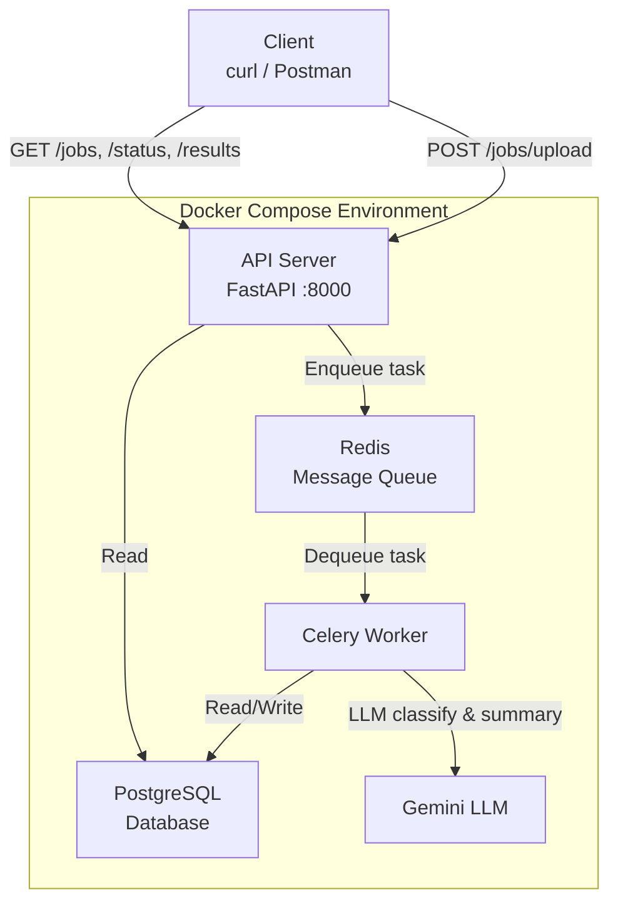
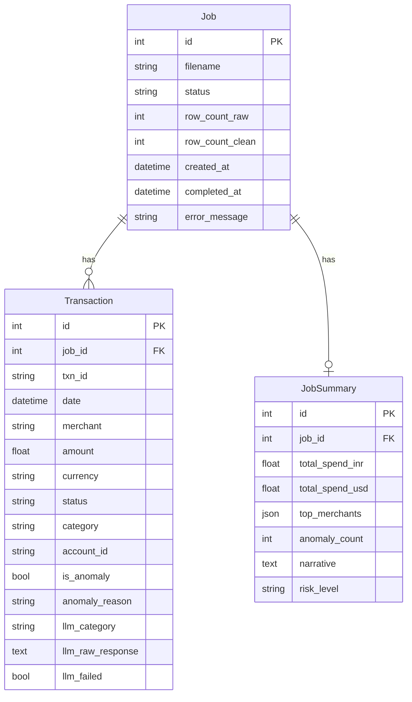
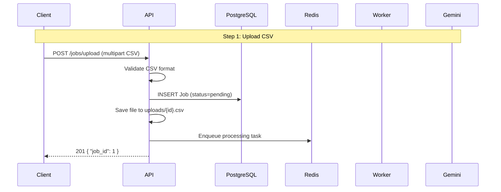
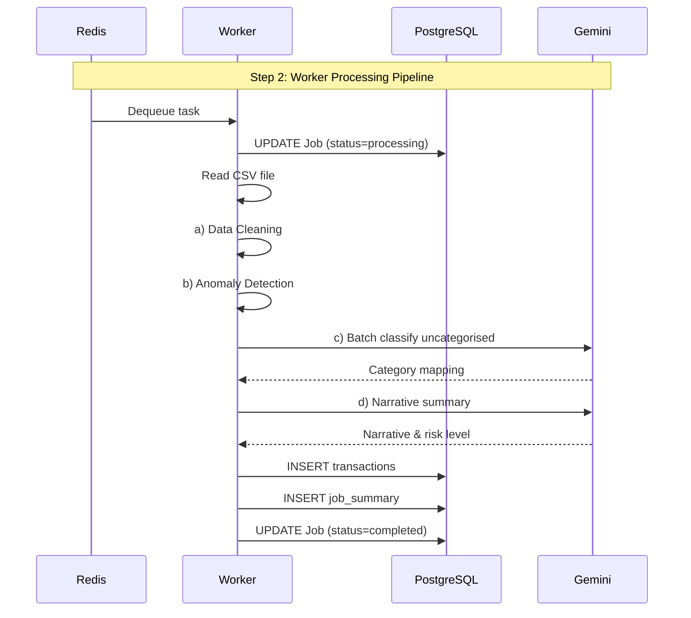
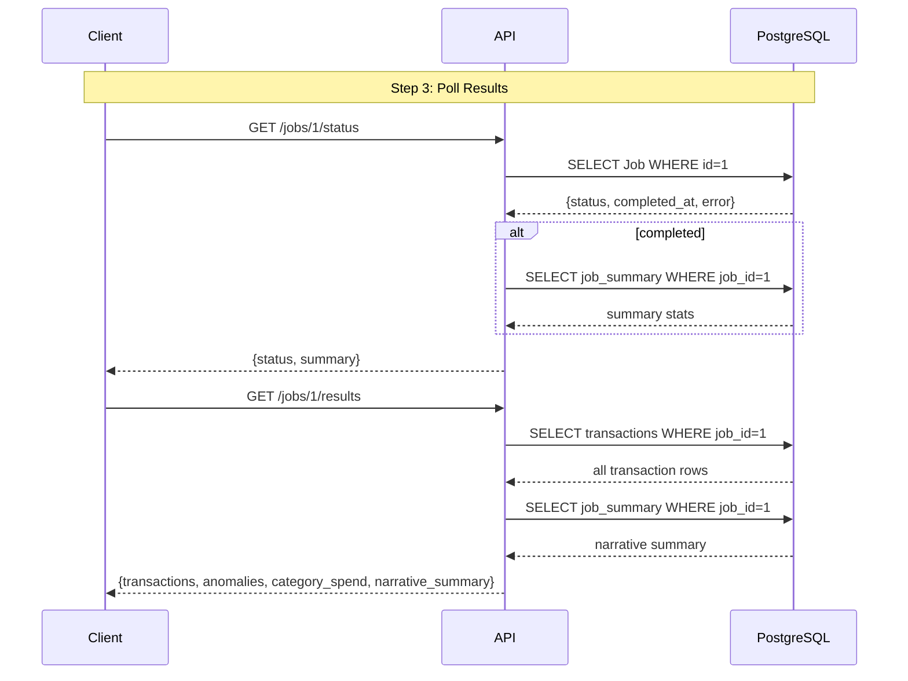

# AI-Powered Transaction Processing Pipeline

A backend API that accepts dirty CSV transaction data, processes it asynchronously through a job queue, uses an LLM to classify transactions and flag anomalies, and generates a structured summary report.

---

## System Architecture



### Containers (Docker Compose Services)

| Service     | Image                    | Port  | Purpose                              |
|-------------|--------------------------|-------|--------------------------------------|
| **api**     | Python 3.12-slim + FastAPI | 8000  | HTTP API — accepts uploads, serves results |
| **worker**  | Python 3.12-slim + Celery | —     | Async processing pipeline            |
| **redis**   | Redis 7-alpine           | 6379  | Message broker for Celery            |
| **postgres**| PostgreSQL 16-alpine     | 5432  | Persistent storage                   |

---

## Database Schema (ERD)



**Key relationships:**
- `Job` 1──N `Transaction` (a job has many transactions)
- `Job` 1──1 `JobSummary` (a job has one summary)

---

## Request Lifecycle

### 1. Upload CSV → `POST /jobs/upload`



### 2. Worker Processes Job (Async)



### 3. Poll Results → `GET /jobs/{id}/status` & `/results`



---

## End-to-End Workflow

### 1. Client Uploads CSV
The user sends a CSV file via `POST /jobs/upload`. The FastAPI server validates the file extension (.csv) and parses it to ensure it's a valid CSV. A `Job` record is created in PostgreSQL with status `pending`, the original CSV is saved to `uploads/{job_id}.csv`, and a Celery task is enqueued to Redis. The job ID is returned immediately — no blocking.

### 2. Celery Worker Dequeues & Processes
The Celery worker picks up the task from Redis and begins the 5-step pipeline:

- **Data Cleaning** — Normalises dates (DD-MM-YYYY, YYYY/MM/DD → ISO 8601), strips `$` from amounts, uppercases currency/status, fills blank categories with `"Uncategorised"`, and removes exact duplicate rows.
- **Anomaly Detection** — Flags transactions where amount > 3x the account median and flags USD transactions at domestic-only merchants (Swiggy, Ola, IRCTC).
- **LLM Classification** — Sends all uncategorised transactions in one batch to Gemini. Gemini returns a JSON mapping of row index → category. Failed classifications are marked `llm_failed` and the job continues.
- **Narrative Summary** — Sends aggregate stats (total spend by currency, top 3 merchants, anomaly count) to Gemini. Gemini returns a 2-3 sentence spending narrative and a risk level.
- **Persistence** — All cleaned transactions, the narrative summary, and the final `completed` status are saved to PostgreSQL.

### 3. Client Polls for Results
The client polls `GET /jobs/{id}/status` until status is `completed`. Once done, `GET /jobs/{id}/results` returns the full structured output: cleaned transactions, flagged anomalies, per-category spend breakdown, and the LLM-generated narrative summary.

### 4. Retry & Error Handling
LLM calls retry up to 3 times with exponential backoff (2s, 4s, 8s). If all retries fail, the batch is marked `llm_failed` and the pipeline continues — LLM failures never fail the entire job. Other errors (file not found, DB issues) mark the job as `failed` with the error message stored.

---

## Processing Pipeline (Worker)

When a job is dequeued from Redis, the Celery worker executes these steps **in order**:

### a) Data Cleaning
| Rule | Example |
|------|---------|
| Normalise dates to ISO 8601 | `04-09-2024` → `2024-09-04`, `2024/02/05` → `2024-02-05` |
| Strip `$` from amounts | `$11325.79` → `11325.79` |
| Uppercase currency codes | `inr` → `INR`, `usd` → `USD` |
| Uppercase status values | `success` → `SUCCESS`, `failed` → `FAILED` |
| Fill missing categories | `""` → `"Uncategorised"` |
| Remove exact duplicate rows | Identical rows collapsed to one |

### b) Anomaly Detection
| Rule | Condition | Reason |
|------|-----------|--------|
| Statistical outlier | `amount > 3 × account_median` | `"Amount exceeds 3x account median"` |
| Currency mismatch | `currency = USD` AND `merchant IN (Swiggy, Ola, IRCTC)` | `"USD transaction with domestic-only merchant"` |

### c) LLM Classification (Batch)
- Collects all transactions with `category = "Uncategorised"`
- Sends a **single batched prompt** to Gemini with all uncategorised rows
- Gemini returns a JSON array mapping each row index to a category
- Categories: `Food`, `Shopping`, `Travel`, `Transport`, `Utilities`, `Cash Withdrawal`, `Entertainment`, `Other`

### d) LLM Narrative Summary
- Sends aggregate stats (total spend by currency, top 3 merchants, anomaly count) to Gemini
- Gemini returns: `narrative` (2-3 sentence analysis) + `risk_level` (`low`/`medium`/`high`)

### e) Retry Logic
- Each LLM call is retried **up to 3 times** with exponential backoff (`2^attempt` seconds)
- If all retries fail, the batch is marked `llm_failed = True` and processing continues
- **The job is never failed entirely due to LLM failure**

---

## API Endpoints

### `POST /jobs/upload`
Accepts a CSV file, validates it, creates a Job record, enqueues the processing task.

```bash
curl -X POST http://localhost:8000/jobs/upload \
  -F "file=@transactions.csv"
```

**Response** `201 Created`
```json
{"job_id": 1}
```

---

### `GET /jobs/{job_id}/status`
Returns the current status of the job.

```bash
curl http://localhost:8000/jobs/1/status
```

**Response (pending):**
```json
{"id": 1, "status": "pending", "summary": null, "error_message": null}
```

**Response (completed):**
```json
{
  "id": 1,
  "status": "completed",
  "summary": {
    "total_spend_inr": 1339923.0,
    "total_spend_usd": 74185.14,
    "anomaly_count": 5,
    "risk_level": "low"
  },
  "error_message": null
}
```

**Response (failed):**
```json
{
  "id": 1,
  "status": "failed",
  "summary": null,
  "error_message": "FileNotFoundError: Uploaded file not found"
}
```

---

### `GET /jobs/{job_id}/results`
Returns the full structured output.

```bash
curl http://localhost:8000/jobs/1/results
```

**Response** `200 OK`
```json
{
  "transactions": [
    {
      "txn_id": "TXN1065",
      "date": "2024-09-04",
      "merchant": "Flipkart",
      "amount": 10882.55,
      "currency": "INR",
      "status": "SUCCESS",
      "category": "Shopping",
      "account_id": "ACC003",
      "is_anomaly": false,
      "anomaly_reason": null,
      "llm_category": null
    }
  ],
  "anomalies": [
    {
      "txn_id": "TXN2003",
      "merchant": "IRCTC",
      "amount": 193647.29,
      "currency": "INR",
      "is_anomaly": true,
      "anomaly_reason": "Amount exceeds 3x account median"
    }
  ],
  "category_spend": [
    {"category": "Food", "count": 12, "total": 105463.22},
    {"category": "Shopping", "count": 16, "total": 128419.35}
  ],
  "narrative_summary": {
    "total_spend_inr": 1339923.0,
    "total_spend_usd": 74185.14,
    "top_merchants": ["IRCTC", "Jio Recharge", "Flipkart"],
    "anomaly_count": 5,
    "narrative": "Spending is heavily concentrated in travel ...",
    "risk_level": "low"
  }
}
```

---

### `GET /jobs`
List all jobs with optional status filter.

```bash
curl http://localhost:8000/jobs
curl "http://localhost:8000/jobs?status=completed"
```

**Response** `200 OK`
```json
[
  {
    "id": 1,
    "filename": "transactions.csv",
    "status": "completed",
    "row_count_raw": 95,
    "created_at": "2026-06-17T05:57:43.845419Z"
  }
]
```

---

## Quick Start

### Prerequisites
- Docker & Docker Compose
- Gemini API key (optional — pipeline runs without it, but skips LLM calls)

### Setup

```bash
# 1. Clone the repository
git clone <repo-url>
cd <repo-directory>

# 2. (Optional) Add Gemini API key
echo "GEMINI_API_KEY=your_key_here" > .env

# 3. Start everything
docker compose up --build
```

The API is available at `http://localhost:8000`.

### Testing
```bash
# Upload sample data
curl -X POST http://localhost:8000/jobs/upload -F "file=@transactions.csv"

# Poll until completed
curl http://localhost:8000/jobs/1/status

# Get full results
curl http://localhost:8000/jobs/1/results
```

### Running Unit Tests
```bash
pip install -r requirements.txt
pytest tests/ -v
```

---

## Project Structure

```
├── docker-compose.yml          # 4 services: api, worker, redis, postgres
├── Dockerfile                  # Python 3.12-slim image
├── requirements.txt            # Python dependencies
├── transactions.csv            # Sample data (95 rows)
├── .env                        # Environment variables (gitignored)
├── .gitignore
├── README.md
│
├── app/
│   ├── __init__.py
│   ├── main.py                 # FastAPI app, startup, router registration
│   ├── config.py               # pydantic-settings (DB_URL, REDIS_URL, GEMINI_API_KEY)
│   ├── database.py             # SQLAlchemy engine + session factory
│   ├── models.py               # ORM models: Job, Transaction, JobSummary
│   ├── schemas.py              # Pydantic response schemas
│   │
│   ├── api/
│   │   ├── __init__.py
│   │   └── jobs.py             # 4 route handlers (upload, status, results, list)
│   │
│   └── tasks/
│       ├── __init__.py
│       ├── worker.py           # Celery app configuration
│       └── processing.py       # Pipeline: clean, anomalies, LLM classify, summary
│
└── tests/
    ├── __init__.py
    ├── conftest.py             # SQLite test DB, TestClient fixture
    ├── test_cleaning.py        # 7 tests: date formats, $ strip, uppercase, dedup
    ├── test_anomalies.py       # 8 tests: outlier, USD+domestic edge cases
    └── test_api.py             # 9 tests: upload, list, status, errors
```

---

## Technical Decisions

| Decision | Choice | Rationale |
|----------|--------|-----------|
| **API Framework** | FastAPI | Async-native, auto-generated OpenAPI docs, Pydantic validation |
| **Database ORM** | SQLAlchemy 2.0 | Mature, well-documented, native PostgreSQL support |
| **Job Queue** | Celery + Redis | Industry standard for Python async task processing |
| **LLM Provider** | Gemini 1.5 Flash | Free-tier, 1M token context, no spend required |
| **Containerization** | Docker Compose | Single command startup, reproducible environment |
| **Async Processing** | Celery worker | Avoids blocking the API on long-running pipeline tasks |

---

## Bottlenecks & Scaling Considerations

### Current Bottlenecks
- **Single Celery worker** — only one job processes at a time
- **Polling-based status** — client must poll; no webhook/push mechanism
- **In-memory CSV** — entire CSV loaded into RAM during processing
- **Single Gemini model** — all LLM calls go through one API key

### Production Improvements
- Horizontal scaling: increase `--concurrency=N` on worker or run multiple worker containers
- Webhook callback: notify client on completion instead of polling
- Stream CSV parsing: process large files row-by-row without loading entirely into memory
- LLM fallback chain: try multiple models/providers with priority
- Connection pooling: tune SQLAlchemy pool size for high concurrency

---

## Submission Checklist

- [x] GitHub repository (public)
- [x] `docker compose up` — single command startup
- [x] All 4 API endpoints implemented
- [x] Processing pipeline (clean, anomalies, LLM classify, summary)
- [x] Retry logic with exponential backoff
- [x] 29 passing tests
- [ ] High-Level Visual Diagram (draw.io)
- [ ] 3-minute Technical Video
